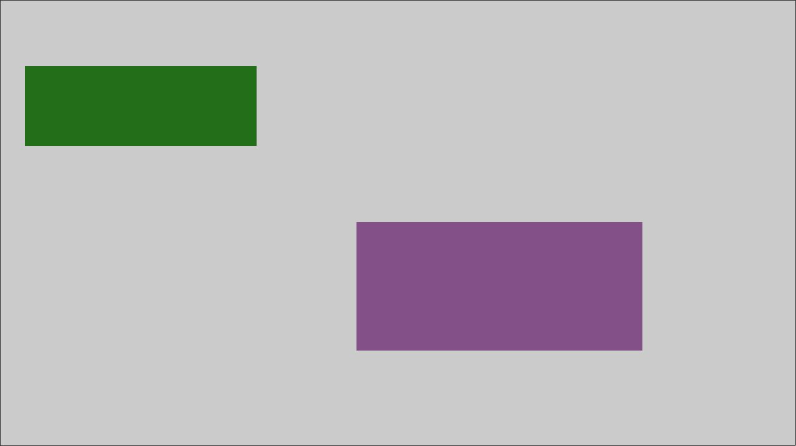

Legion Bound
------------

This SDL2 based application draws two rectangles on a black background, at
random x-, y-positions with random sizes. This work is inspired by the [Legion
TV series](https://www.imdb.com/title/tt5114356) end credits (which itself is
inspired by the _Webdriver Torso_ channel on
[YouTube](https://www.youtube.com/channel/UCsLiV4WJfkTEHH0b9PmRklw)).

Here is an example of the _Legion TV series_ end credit:

And here is an example produced by this application:

License
=======

MIT
